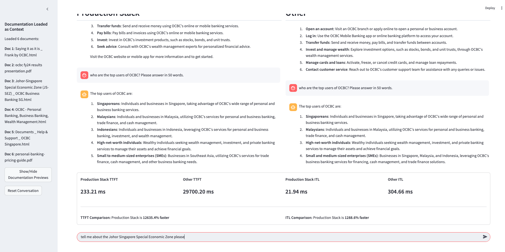
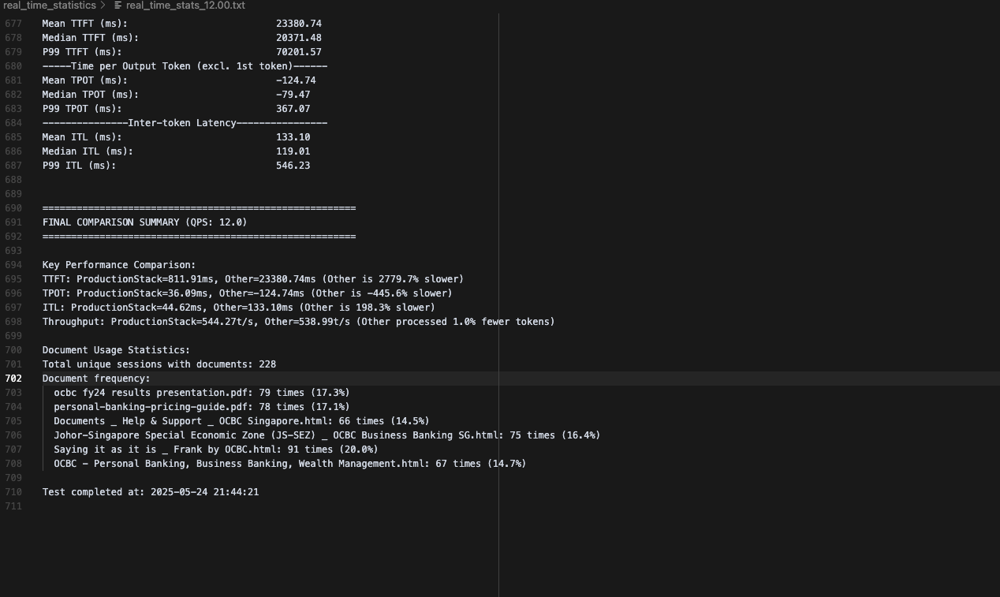

# Simultaneous High-Volume User Chatbot Simulations

## Unlisted Fallback Video (Comparing RayServe):

https://www.youtube.com/watch?v=qLDdIFxFZJU

## TL;DR

1. Feel TTFT/ITL/TPOT in real time through Web UI

2. See aggregated TTFT/ITIL/TPOT statistics on long context multi-user QA with your customized retrieved documents.

3. Test out Fault Tolerance of Production Stack

<p align="center">
  
  
</p>

## Step 1: Deploy Production Stack and Comparison Baseline

### Run:
```bash
# Production Stack + LMCache (Mandatory)
bash dual-baselines/prodstack-lmcache/deploy.sh <MODEL_NAME> <NUM_REPLICAS> <HF_TOKEN>
bash dual-baselines/prodstack-lmcache/deploy.sh meta-llama/Llama-3.1-8B-Instruct 4 hf_...
# Other
# Ray:
bash dual-baselines/rayserve/deploy.sh <ACCELERATOR_TYPE> <MODEL_NAME> <NUM_REPLICAS> <HF_TOKEN>
bash dual-baselines/rayserve/deploy.sh A100 meta-llama/Llama-3.1-8B-Instruct 4 hf_...
# More Coming Soon...
```


### Confirm:
```bash
# To the Production Stack + LMCache OpenAI API now exposed at localhost:30080
# Change the model to the one you selected
curl http://localhost:30080/v1/chat/completions   -H "Content-Type: application/json" -d '{
    "model": "meta-llama/Llama-3.1-8B-Instruct",
    "messages": [
      {"role": "user", "content": "What is the capital of France?"}
    ],
    "max_tokens": 50,
    "temperature": 0.7
  }'

# To the comparison OpenAI API now exposed at localhost:30081
# Change the model to the one you selected
curl http://localhost:30081/v1/chat/completions   -H "Content-Type: application/json" -d '{
    "model": "meta-llama/Llama-3.1-8B-Instruct",
    "messages": [
      {"role": "user", "content": "What is the capital of France?"}
    ],
    "max_tokens": 50,
    "temperature": 0.7
  }'
```

## Step 2: Customize Application specific Long Contexts

Populate the `contexts` folder with .html or .pdf or .txt files. These will be the files that will be randomly selected to form the long contexts for the multiround QA.

## Step 3: Joining a Live Long Context Multi-Round Multi-User QA Simulation!!

### Deploying the automated users

System Prompt is 3000 tokens, Conversation History goes up to 30000 tokens. Around 200 users at any given moment asking for short answers (~100 tokens) based on the document.

```bash
bash ./dual-qa/long_input_short_output_run.sh <MODEL-NAME> [LIST OF QPS]
# Example:
bash ./dual-qa/long_input_short_output_run.sh meta-llama/Llama-3.1-8B-Instruct 8
# 6 is a lighter workload
# 12 is a very intense workload for 4 serving engines
```

### Real Time Statistics: TTFT, ITL, TPOT, Throughput

You'll be able to find real time files in `real_time_statistics`
- `real_time_statistics/real_time_stats_{qps}.txt` will summarize the TTFT, ITL, TPOT, and Throughput comparisons every 5 seconds with the number of currently active users, input and output tokens, and long contexts used for each user.

```text
TTFT: ProductionStack=241.35ms, Other=2999.92ms (Other is 1143.0% slower)
TPOT: ProductionStack=14.57ms, Other=59.70ms (Other is 309.8% slower)
ITL: ProductionStack=16.95ms, Other=90.99ms (Other is 436.9% slower)
Output throughput: ProductionStack=523.71 t/s, Other=484.96 t/s (Other processed 7.4% fewer tokens)
```

## Run the interactive Streamlit app to directly compare both endpoints:

```bash
bash dual-chat/run_demo.sh
```

Then open `http://localhost:8501/`

You will feel the difference if the automated users are running the background.

## Step 4: Fault Tolerance

Run:

```bash
curl -X POST http://localhost:30080/v1/completions \
  -H "Content-Type: application/json" \
  -d '{
    "model": "meta-llama/Llama-3.1-8B-Instruct",
    "prompt": "Generate a super long story about a cat.",
    "max_tokens": 30000,
    "stream": "True"
  }'
```

Check the production stack router logs (same terminal where you deployed) to see which port handled your request. Check `nvidia-smi` to see
the correspodning `PID` for the port. e.g. 8101 would be `3078335` in this example:

```text
+-----------------------------------------------------------------------------------------+
| Processes:                                                                              |
|  GPU   GI   CI              PID   Type   Process name                        GPU Memory |
|        ID   ID                                                               Usage      |
|=========================================================================================|
|    1   N/A  N/A         3078335      C   /opt/venv/bin/python3                 73030MiB |
|    3   N/A  N/A         3078513      C   /opt/venv/bin/python3                 73030MiB |
|    4   N/A  N/A         2712828      C   ...EngineBackgroundProcess.start      72794MiB |
|    5   N/A  N/A         2712823      C   ...EngineBackgroundProcess.start      72808MiB |
|    6   N/A  N/A         3118006      C   ...EngineBackgroundProcess.start      72546MiB |
|    7   N/A  N/A         2712892      C   ...EngineBackgroundProcess.start      72792MiB |
+-----------------------------------------------------------------------------------------+
```

However, if you see `8101`, that means the next request will go to `8103` (in this example), which is `3078513`.

Send another request and then run:
```bash
sudo kill -9  3078513
```

You should see the response *continue* to stream. Check the logs and you will see that another serving engine was assigned the stream request.

You can do the same thing by carefully watching the logs of your other orchestration baseline (e.g. RayServe) and see if they handle fault tolerance properly like production stack does.